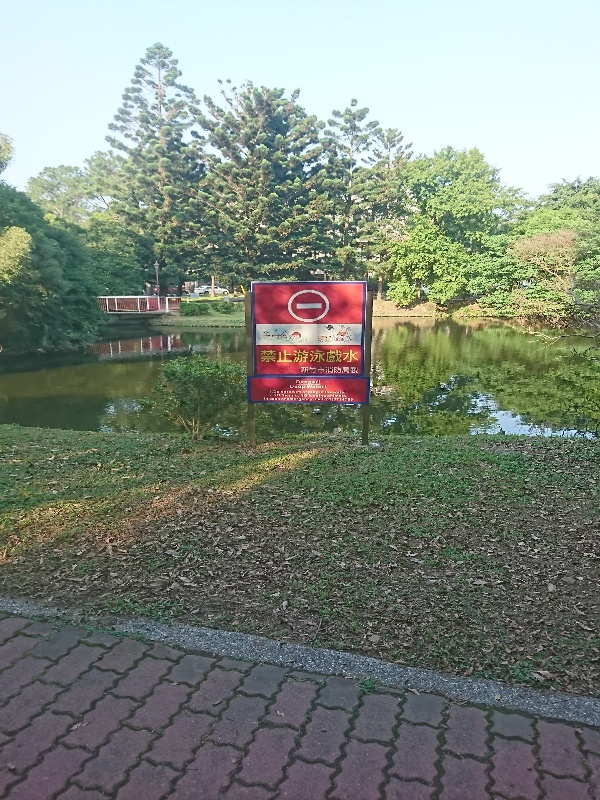
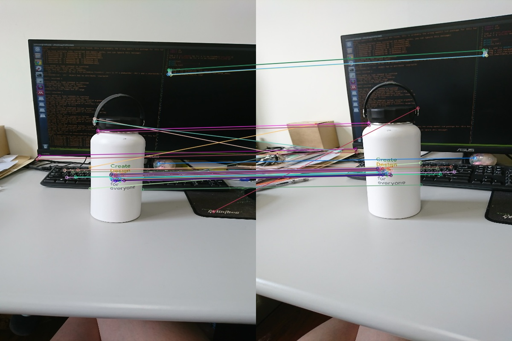
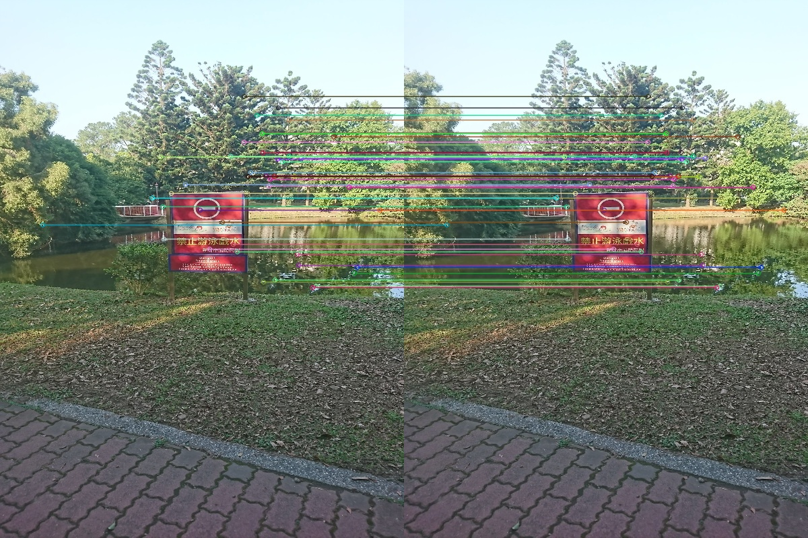
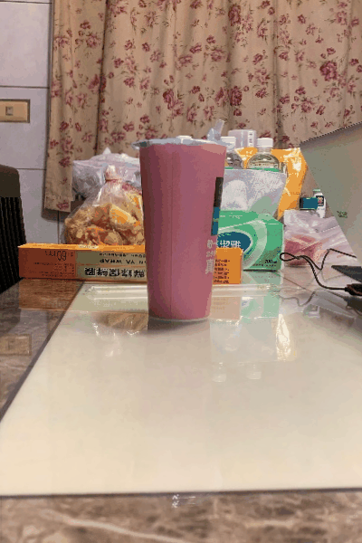

# CVFX-HW5
Scores
(5%) Take multi-view images by yourselves
(5%) Show image alignment results between different images
(20%) Generate the multi-view 3D visual effects
(10%) Exploit creativity to add some image processing to enhance effect (Using post-production software is allowed)
(10%) Bonus - Complete the above 3 different effects
(30%) Assistant score
(20%) Mutual evaluation
Motion parallax
## 1.Take multi-view images by myself
|              |Image1|Image2|Image3|Image4|Image5|
|--------------|------|------|------|------|------|
|**Example 1**|||||
|**Example 2**|||||
|**Example 3**|||

## 2.image alignment results
In our homework, we use the center image of captured order as basline. In term of, the other images all need to align with the image whose captured order was middle.  
Here show the alignment results of Example 1 

|All align with Image3 (center image)|**Example 1**|
|:-------------------:|-------------|
|Image1||
|Image2||
|Image3||
|Image4||
|Image5||

## 3.Generate the multi-view 3D visual effects
Totally, we do three cases in motion parallex. Here show the results.

|             |**GIF Result**|
|:-----------:|--------------|
|**Example 1**||
|**Example 2**||
|**Example 3**||
